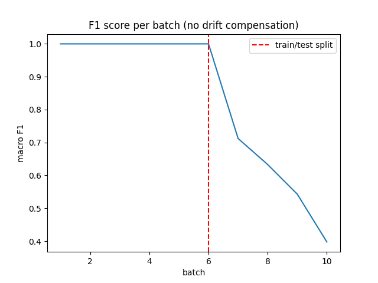
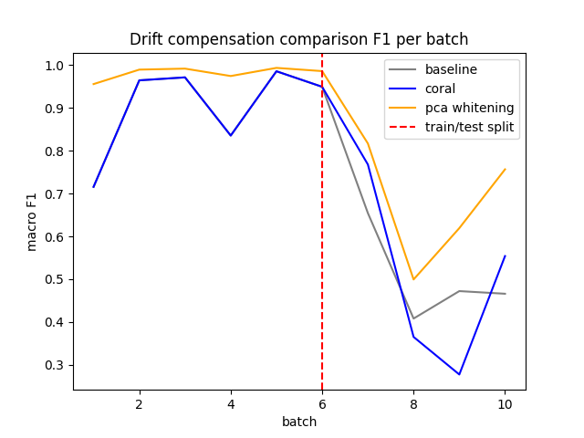
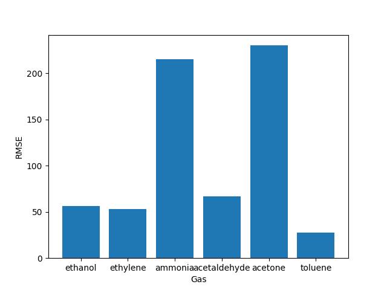

# Sensor Drift Compensation

Gas identification and concentration estimation from a 16-sensor metal oxide array, with drift compensation to maintain accuracy over 36 months of sensor degradation. Implements and compares two unsupervised domain adaptation methods — CORAL and PCA Whitening — on the UCI Gas Sensor Array Drift dataset.

## Results





## Tech Stack

| Component | Technology |
|---|---|
| Dataset | UCI Gas Sensor Array Drift (13,910 samples, 6 gases, 10 batches / 36 months) |
| Data processing | Polars, NumPy |
| Drift compensation | CORAL (Sun et al. 2016), PCA Whitening |
| Classification | SVM (CalibratedClassifierCV), Random Forest — scikit-learn |
| Concentration regression | XGBoost (one model per gas class) |
| Dimensionality reduction | PCA (10 components) |
| Experiment tracking | MLflow |
| Configuration | Pydantic v2 + YAML |
| Environment | Python 3.14+, uv |

## Problem

Metal oxide (MO) gas sensors drift over time — their response shifts even at constant gas concentration. A classifier trained on early batches degrades sharply on measurements collected months later, without any change in the underlying gas. This project addresses that with two unsupervised compensation strategies that require no labeled data from the target period.

## Drift Compensation

**CORAL (CORrelation ALignment)** aligns the mean and covariance of the test batch to the training distribution:

```
X_aligned = (X_target − μ_T) · C_T^(−½) · C_S^(½) + μ_S
```

Tikhonov regularization (`C + 1e-5 · I`) stabilises the matrix square roots on small batches (some test batches have fewer than 300 samples for 128 features). Compensation is applied per-batch to capture per-batch drift rather than averaged global drift.

**PCA Whitening** fits a 10-component whitened PCA on the training data and projects each test batch into that subspace. This removes sensor cross-correlations and suppresses low-variance drift components.

## System Architecture

```
UCI Gas Sensor Array Drift Dataset
16 MO sensors × 8 features = 128D input
              │
              ▼
┌─────────────────────────────────────┐
│  Data Loader                        │
│  Polars DataFrame per batch         │
│  label · concentration · 128 feats  │
└─────────────────────────────────────┘
              │
              ▼
┌─────────────────────────────────────┐
│  Drift Compensator                  │
│  CORAL │ PCA Whitening              │
│  mean + covariance alignment        │
│  fitted on train batches 1-6        │
└─────────────────────────────────────┘
              │
              ▼
┌─────────────────────────────────────┐
│  Classifier                         │
│  PCA → SVM │ Random Forest          │
│  → gas class + confidence           │
│  ethanol / ethylene / ammonia /     │
│  acetaldehyde / acetone / toluene   │
└─────────────────────────────────────┘
              │
              ▼
┌─────────────────────────────────────┐
│  Regressor                          │
│  XGBoost (one model per gas class)  │
│  → concentration [ppm]              │
└─────────────────────────────────────┘
              │
              ▼
┌─────────────────────────────────────┐
│  Output                             │
│  gas · confidence · ppm · drift_risk│
└─────────────────────────────────────┘
```

## Getting Started

**Requirements**

- Python 3.14+
- uv

**Installation**

```bash
git clone https://github.com/Stoooq/sensor-drift-compensation
cd sensor-drift-compensation
uv sync
```

**Run inference**

```bash
uv run python main.py
```

**Explore notebooks**

| Notebook | Contents |
|---|---|
| `01_eda.ipynb` | Dataset overview, batch statistics, sensor response visualisation |
| `02_baseline.ipynb` | SVM and RF classifiers on uncompensated data - establishes drift baseline |
| `03_regression.ipynb` | Per-class XGBoost regressors for concentration estimation |
| `04_drift_compensation.ipynb` | CORAL and PCA Whitening evaluation across test batches 7-10 |

**Track experiments**

```bash
uv run mlflow ui --backend-store-uri sqlite:///mlflow.db
```

## Project Structure

```
sensor-drift-compensation/
├── main.py                   # CLI entry point
├── config.yaml               # Central config: sensors, batches, model types
├── src/
│   ├── config.py             # Pydantic v2 AppConfig — paths, data, features, models
│   ├── data_loader.py        # UCI .dat parser → Polars DataFrames per batch
│   ├── pipeline.py           # InferencePipeline: compensate → classify → regress
│   └── models/
│       ├── classifier.py     # SVM (calibrated) and RF sklearn Pipeline factories
│       ├── compensator.py    # CORALCompensator and PCAWhiteningCompensator
│       └── regressor.py      # XGBoost regressor factory (one instance per gas class)
├── notebooks/
│   ├── 01_eda.ipynb
│   ├── 02_baseline.ipynb
│   ├── 03_regression.ipynb
│   └── 04_drift_compensation.ipynb
├── data/                     # UCI batch files (batch1.dat … batch10.dat)
├── models/                   # Serialised model artefacts (.pkl)
├── results/                  # Evaluation plots
├── pyproject.toml
└── config.yaml
```

## Dataset

UCI Gas Sensor Array Drift Dataset - 13,910 measurements of 6 gases collected from a 16-sensor MO array over 36 months, split into 10 temporal batches. Batches 1-6 are used for training; batches 7-10 for drift evaluation.

> Vergara A., Vembu S., Ayhan T., Ryan M. A., Homer M. L., Huerta R. (2012). Chemical gas sensor drift compensation using classifier ensembles. *Sensors and Actuators B: Chemical*, 166-167, 320-329.
